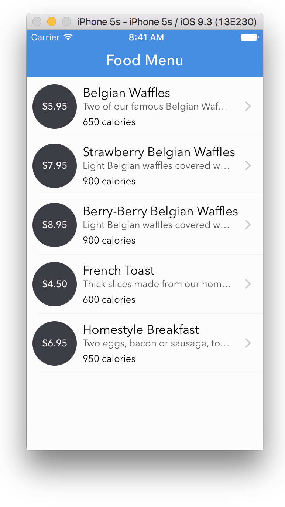

# Parsing XML in iOS using NSXMLParser
We are going to populate a table view controller using a simple XML file from the web. The code examples in this article will be written using Swift. I assume that you have already setup the TableViewController to read the input and populate the table. We will be concentrating on parsing the XML file in this article.

To parse an XML file in iOS we can make use of the NSXMLParser class from the foundation framework. We will be working with an XML data that represents food menu so lets say that our table view controller class is called FoodTableViewController.

## Downloading the XML data
The first thing that we have to do is download the XML data from the web. The NSURLSession class and related classes provide an API for downloading content.

```swift
func getData() {
    let defaultSession = NSURLSession(configuration: NSURLSessionConfiguration.defaultSessionConfiguration())

    //tells iOS to start the loading button on the status bar
    UIApplication.sharedApplication().networkActivityIndicatorVisible = true

    let link = "http://www.w3schools.com/xml/simple.xml"
    if let url = NSURL(string: link) {
        let dataTask = defaultSession.dataTaskWithURL(url) {
            data, response, error in

            //Stop the loading button in status bar - make sure this UI change is made in the main thread
            dispatch_async(dispatch_get_main_queue()) {
                UIApplication.sharedApplication().networkActivityIndicatorVisible = false
            }

            if let error = error {
                print(error.localizedDescription)
            } else if let httpResponse = response as? NSHTTPURLResponse {
                if httpResponse.statusCode == 200 {
                    //Create an XML parser with the NSData from the server and set the FoodTableViewController as the delegate
                    let xmlParser = NSXMLParser(data: data!)
                    xmlParser.delegate = self
                    xmlParser.parse()
                }
            }
        }
        dataTask.resume()
    }
}
```
The above code makes a http GET request to the link present in the link variable. Since the link represents a static XML file that is hosted on the server the response of the request will be the XML data. The link could also be an API that returns the data in XML format.

Once the XML data is downloaded it is made available in data variable ( which is of type NSData? ) of the completion handler. The entire process of making and sending the request and waiting for the response is performed in the background thread by the networking API so that the UI remains responsive. The callback handler that we provide to the dataTaskWithUrl method of the defaultSession object is also called from the background thread only after the data becomes available, therefore we must remember that any code that we write inside of the completion handler does not run in the main thread. 

To understand more about the above code, I would suggest you to read the following. They will give you a lot more insight on how we can use the NSURLSession class, which is a complete suite of networking API methods for uploading and downloading content via HTTP.

> https://www.objc.io/issues/5-ios7/from-nsurlconnection-to-nsurlsession/
> https://www.raywenderlich.com/110458/nsurlsession-tutorial-getting-started
> https://developer.apple.com/library/ios/documentation/Foundation/Reference/NSURLSession_class/

This refreshData method is called from the viewDidLoad method on the table view controller to make sure the we start the process as soon as the view is loaded into the memory.
```swift
override func viewDidLoad() {
    super.viewDidLoad()
    getData()
}
```

## Parsing the XML
Like how every other functionality is built in iOS the XML parsing is also done through the delegation pattern. We create an instance of NSXMLParser class to help with the parsing. The parser will call certain methods on its delegate as it parses the XML document. Lets assign the FoodTableViewController class as the delegate for the parser. The NSXMLParserDelegate protocol defines the optional methods implemented by delegates of NSXMLParser objects.

We will be using 4 delegate methods to parse the file. The 4 delegate methods we will be focusing are:
> parser:didStartElement:namespaceURI:qualifiedName:attributes:
> parser:foundCharacters:
> parser:didEndElement:namespaceURI:qualifiedName:
> parserDidEndDocument:

### didStartElement method
This method is called by the parser object on its delegate whenever it encounters an opening XML tag.

###foundCharacters method
This method is called by the parser object on its delegate whenever it is reading data between an opening tag and closing tag. The data between a tag may be read all at once or it may be read in pieces.

### didEndElement method
This method is called by the parser object on its delegate whenever it encounters a closing XML tag.

### didEndDocument method
This method is called by the parser object on its delegate when it has completed parsing the entire document.

Consider the following XML data.

```xml
<note>
  <to>Tove</to>
  <from>Jani</from>
  <heading>Reminder</heading>
  <body>Don’t forget me this weekend!</body>
</note>
```

```swift
extension FoodTableViewController: NSXMLParserDelegate {

    func parser(parser: NSXMLParser, didStartElement elementName: String, namespaceURI: String?, qualifiedName qName: String?, attributes attributeDict: [String : String]) {
        print("Did start element: \(elementName)")
    }

    func parser(parser: NSXMLParser, foundCharacters string: String) {
        print("Found characters: \(string)")
    }

    func parser(parser: NSXMLParser, didEndElement elementName: String, namespaceURI: String?, qualifiedName qName: String?) {
        print("Did end element: \(elementName)")
    }

    func parserDidEndDocument(parser: NSXMLParser) {
        print("Completed parsing document")
    }
}
```

If we implement the delegate methods as shown above then the output that we get is.

```txt
Did start element: note
Found characters:

Did start element: to
Found characters: Tove
Did end element: to
Found characters:

Did start element: from
Found characters: Jani
Did end element: from
Found characters:

Did start element: heading
Found characters: Reminder
Did end element: heading
Found characters:

Did start element: body
Found characters: Don’t forget me this weekend!
Did end element: body
Found characters:

Did end element: note
Completed parsing document
```
We will be using the following XML file for our demo.
```xml
<?xml version="1.0" encoding="UTF-8"?>
<breakfast_menu>
	<name>This is a simple name data</name>
	<food>
		<name>Belgian Waffles</name>
		<price>$5.95</price>
		<desc>Two of our famous Belgian Waffles with plenty of real maple syrup</desc>
		<calories>650</calories>
	</food>
	<food>
		<name>Strawberry Belgian Waffles</name>
		<price>$7.95</price>
		<desc>Light Belgian waffles covered with strawberries and whipped cream</desc>
		<calories>900</calories>
	</food>
	<food>
		<name>Berry-Berry Belgian Waffles</name>
		<price>$8.95</price>
		<desc>Light Belgian waffles covered with an assortment of fresh berries and whipped cream</desc>
		<calories>900</calories>
	</food>
	<food>
		<name>French Toast</name>
		<price>$4.50</price>
		<desc>Thick slices made from our homemade sourdough bread</desc>
		<calories>600</calories>
	</food>
	<food>
		<name>Homestyle Breakfast</name>
		<price>$6.95</price>
		<desc>Two eggs, bacon or sausage, toast, and our ever-popular hash browns</desc>
		<calories>950</calories>
	</food>
</breakfast_menu>
```
Lets define a few variable in Swift that can help us with the parsing. We create a food structure that represents a single food item. In swift if we don't provide an initializer for a structure it automatically provides a member wise initializer that we can use to create an instance.
```swift
struct Food {
    let name: String
    let price: String
    let desc: String
    let calories: String
}

class FoodTableViewController: UITableViewController {

    var list = [Food]()

    var name: String = ""
    var price: String = ""
    var desc: String = ""
    var calories: String = ""

    var currentlyParsingElement: String = ""
    var insideFoodItem = false
    //Rest of your table view controller code here
}
```

We are interested only in the data within each of the food item. If we have lets say the <name> tag anywhere else in the XML we would not like to take that into account. Therefore when we encounter <food> i.e when we enter into a food tag we mark the insideFoodItem variable as true and set to false once we encounter </food>. This helps us identity at any point whether we are currently inside of a food item or not during the parsing process.

The currentlyParsingElement variable holds the name of the tag that we are currently parsing, i.e if we encounter a opening <name> tag then we set `currentlyParsingElement = "name"`

```swift
extension FoodTableViewController: NSXMLParserDelegate {
    func parser(parser: NSXMLParser, didStartElement elementName: String, namespaceURI: String?, qualifiedName qName: String?, attributes attributeDict: [String : String]) {
        if elementName == "food" {
            insideFoodItem = true
        }
        if insideFoodItem {
            switch elementName {
            case "name":
                name = ""
                currentlyParsingElement = "name"
            case "price":
                price = ""
                currentlyParsingElement = "price"
            case "desc":
                desc = ""
                currentlyParsingElement = "desc"
            case "calories":
                calories = ""
                currentlyParsingElement = "calories"
            default: break
            }
        }
    }

    func parser(parser: NSXMLParser, foundCharacters string: String) {
        if insideFoodItem {
            switch currentlyParsingElement {
            case "name":
                name = name + string
            case "price":
                price = price + string
            case "desc":
                desc = desc + string
            case "calories":
                calories = calories + string
            default: break
            }
        }
    }

    func parser(parser: NSXMLParser, didEndElement elementName: String, namespaceURI: String?, qualifiedName qName: String?) {
        if insideFoodItem {
            switch elementName {
            case "name":
                currentlyParsingElement = ""
            case "price":
                currentlyParsingElement = ""
            case "desc":
                currentlyParsingElement = ""
            case "calories":
                currentlyParsingElement = ""
            default: break
            }
            if elementName == "food" {
                let food = Food(name: name, price: price, desc: desc, calories: calories)
                list.append(food)
                insideFoodItem = false
            }
        }
    }

    func parserDidEndDocument(parser: NSXMLParser) {
        dispatch_async(dispatch_get_main_queue()) {
            self.tableView.reloadData()
        }
    }
}
```

As you can see in the code above in the didStartElement method we clear out any existing data from the corresponding temporary variable and mark the element that is being currently parsed. We have the currentlyParsingElement variable because without it the foundCharacters method does not know for which tag the data that we are currently parsing belongs to. And in the foundCharacters method all that we do is append the data that we are parsing to the corresponding temporary variable ( we are appending because the data may not be parsed in a single go, it may be parsed in chunks ). In the dodEndElement method we clear out the currenlyParsingElement. If we don't clear out the currentlyParsingElement then the data inside the non interested tags will also get appended. Lets say we don't clear out the currenlyParsingElement variable which is set to "name", then lets say now if we encounter a disinterested tad <date> then its content will also be appended to the name temporary variable, which is clearly what we don't want.

Once the XML document has been finished parsing, the parser object calls the parserDidEndDocument and we ask the table view to reload the data. You should remember that we called the parse method on the parser to start the parsing from the callback once the XML data has been downloaded. That callback is executed in the background thread when the XML downloading process is complete. Therefore all the parsing ( the method calls by parser on the delegate ) also happens in the background thread, i.e why we make sure that reloading the table data happens in the main thread, because any UI updates or changes that we make should always happen on the main thread.

Once the list is populated with data. It would look like the following.

